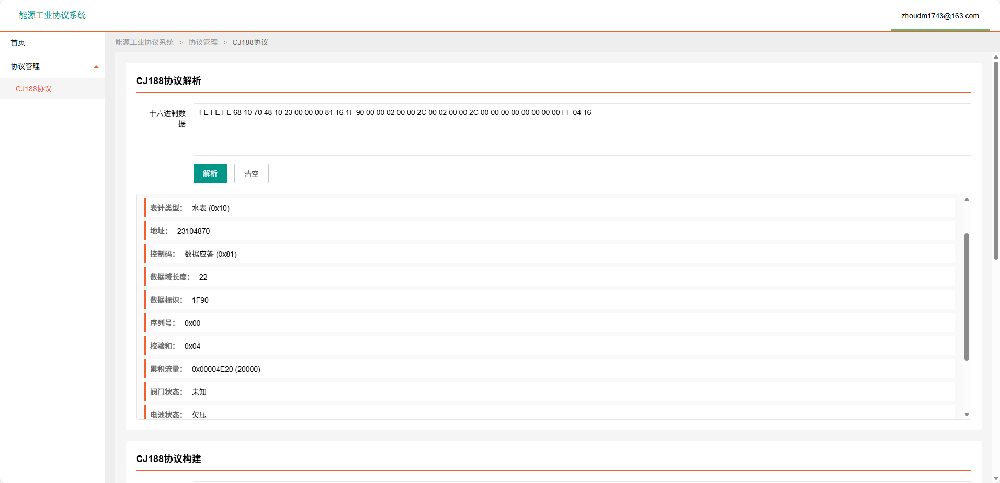
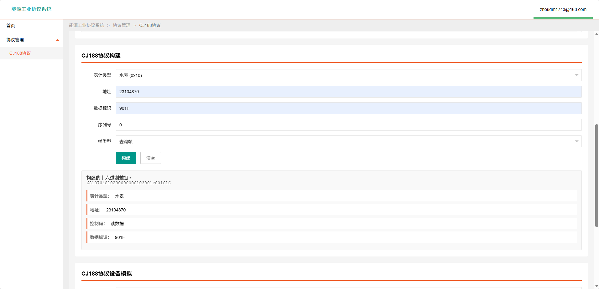
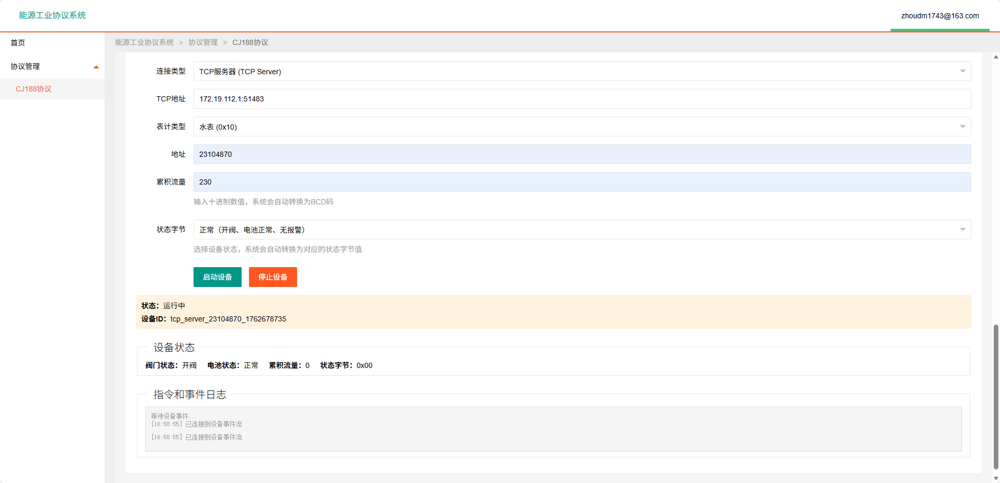

# 能源工业协议

一个基于 Go 语言实现的能源工业协议解析、构建和模拟系统，支持多种工业通信协议的开发、测试和调试。

## 功能列表

| 功能模块 | 功能描述 |
|---------|---------|
| 协议解析 | 支持十六进制协议帧的解析<br>自动识别协议帧结构（起始符、地址、控制码、数据域等）<br>解析结果包含完整的协议字段信息<br>支持 BCD 码转换和解析 |
| 协议构建 | 根据配置参数构建协议帧<br>支持查询帧和应答帧的构建<br>自动计算校验码<br>支持地址、数据标识、序列号等字段的配置 |
| 设备模拟 | **串口模式**：模拟通过串口连接的设备<br>**TCP 服务器模式**：模拟作为 TCP 服务器的设备，接受客户端连接<br>**TCP 客户端模式**：模拟作为 TCP 客户端的设备，主动连接服务器<br>支持接收主站指令并自动回复<br>支持控制指令处理（开关阀、参数设置等）<br>实时显示设备状态变化<br>支持设备状态可视化监控 |
| 实时监控 | 基于 Server-Sent Events (SSE) 的实时事件推送<br>设备指令接收日志<br>设备状态变化日志<br>协议帧收发日志<br>支持多客户端同时监控 |

### 协议支持

- [x] **CJ/T 188**：城镇燃气编码远传表通信协议
- [ ] **Q/GDW 376.1**：电力用户用电信息采集系统 主站与采集终端通信协议
- [ ] **DL/T 645**：多功能电能表通信协议
- [x] **DL/T 645-2007**：多功能电能表通信协议（2007版）
- [ ] **DL/T 698.45**：电能信息采集与管理系统 数据交换协议
- [ ] **GB/T 19582**：基于Modbus协议的工业自动化网络规范
- [ ] **Modbus**：Modbus 工业通信协议（RTU/TCP）
- [ ] **Cat.1**：LTE Cat.1 无线通信协议（物联网远传协议）


## 技术栈

- **后端**：Go 1.25.3
- **Web 框架**：Gin
- **前端**：Layui + jQuery
- **通信协议**：TCP/IP、串口通信
- **实时通信**：Server-Sent Events (SSE)
- **事件总线**：自定义事件总线系统

## 项目结构

```
protocol/
├── app/                    # 应用层
│   ├── controller/         # 控制器
│   └── dto/               # 数据传输对象
├── protocol/               # 协议实现
│   └── cj188/             # CJ188 协议
├── pkg/                    # 公共包
│   ├── eventbus/          # 事件总线
│   ├── logger/            # 日志系统
│   ├── simu/              # 设备模拟
│   └── sse/               # SSE 管理
├── routes/                 # 路由配置
├── utils/                  # 工具函数
├── webapp/                 # 前端资源
│   ├── pages/             # 页面
│   ├── scripts/           # 脚本
│   └── lib/               # 第三方库
├── static/                 # 静态资源（截图等）
├── main.go                # 程序入口
└── go.mod                 # Go 模块配置
```

## 安装和运行

### 环境要求

- Go 1.25.3 或更高版本
- 支持的操作系统：Windows、Linux、macOS

### 安装步骤

1. 克隆项目
```bash
git clone https://gitee.com/illusoryNone/protocol.git
cd protocol
```

2. 安装依赖
```bash
go mod download
```

3. 编译项目
```bash
go build -o protocol main.go
```

4. 运行程序
```bash
./protocol
# 或
go run main.go
```

程序默认监听 `:8080` 端口，访问 `http://localhost:8080` 即可使用。

## 使用说明

### 协议解析

1. 进入 CJ188 协议页面
2. 在"协议解析"区域输入十六进制协议帧（支持空格分隔）
3. 点击"解析"按钮
4. 查看解析结果，包括帧结构、地址、控制码、数据域等信息

### 协议构建

1. 在"协议构建"区域配置参数：
   - 表计类型（如：16-水表）
   - 表计地址（十进制，如：23104870）
   - 数据标识（如：901F）
   - 序列号
   - 帧类型（查询/应答）
2. 点击"构建"按钮
3. 查看生成的十六进制协议帧

### 设备模拟

1. 在"设备模拟"区域配置设备参数：
   - 连接类型（串口/TCP服务器/TCP客户端）
   - 表计类型
   - 表计地址
   - 累积流量（十进制数值）
   - 状态字节（下拉选择）
   - 连接参数（串口名、波特率、TCP地址等）
2. 点击"启动设备"按钮
3. 设备启动后，可以：
   - 查看设备状态（阀门状态、电池状态、流量数据等）
   - 查看指令和事件日志（实时显示接收的指令和发送的应答）
   - 设备会自动响应主站的查询和控制指令

### 截图说明

#### 协议解析功能



#### 协议构建功能



#### 设备模拟功能




## 许可证

本项目采用 MIT 许可证，详见 [LICENSE](LICENSE) 文件。

## 联系方式

如有问题或建议，请联系：zhoudm1743@163.com

